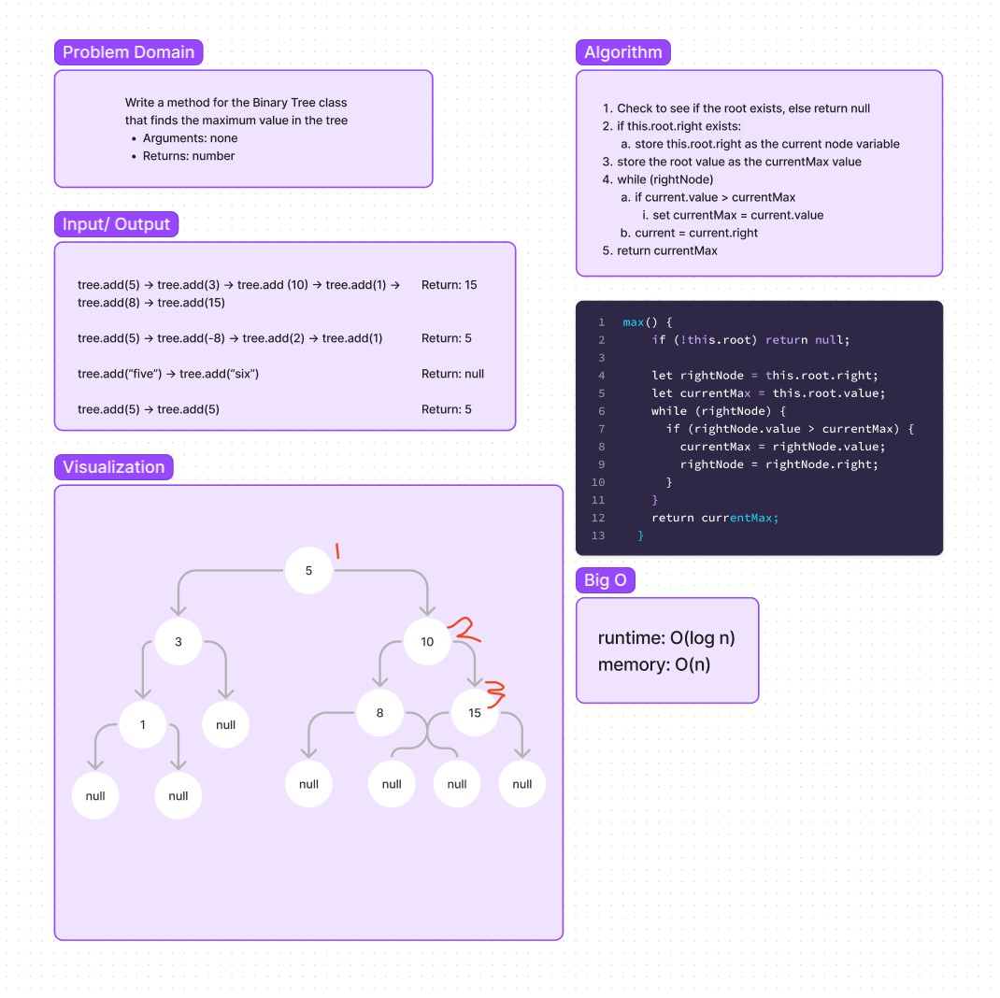
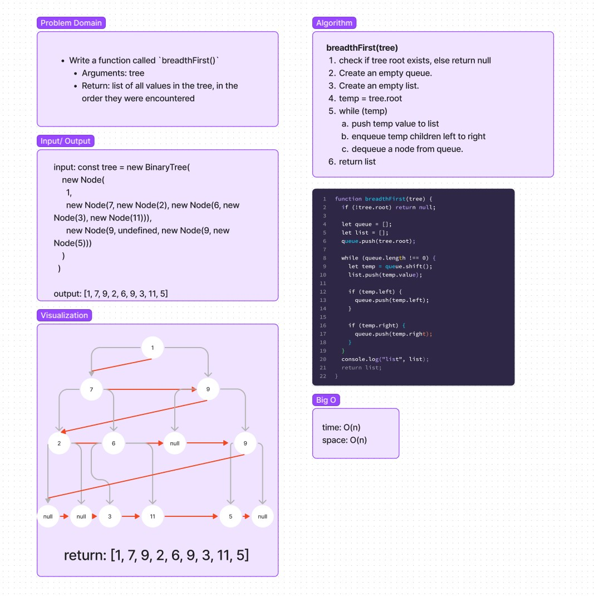
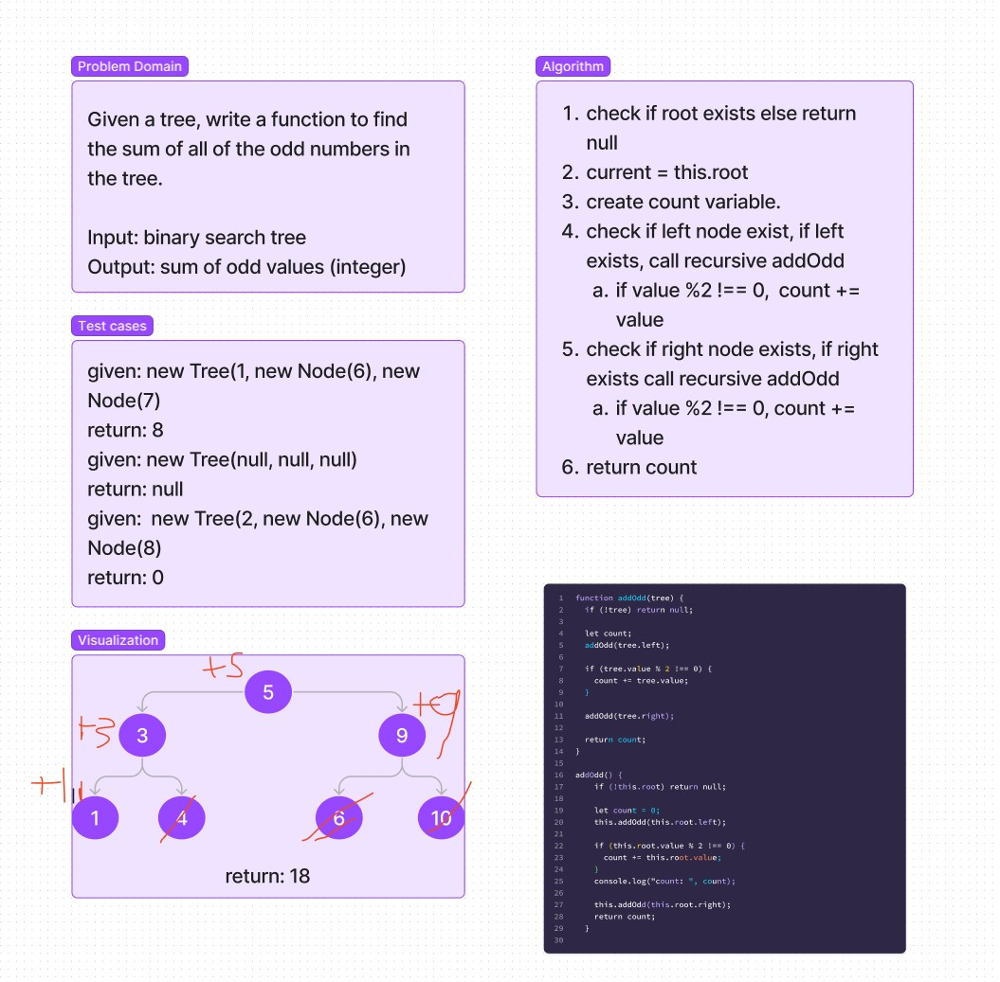

# Trees
<!-- Short summary or background information -->

## Challenge

### Node

- Create a Node class that has properties for the value stored in the node, the left child node, and the right child node.

### Binary Tree

- Create a Binary Tree class
  - Define a method for each of the depth first traversals:
    - pre order
    - in order
    - post order which returns an array of the values, ordered appropriately.

### Binary Search Tree

- Create a Binary Search Tree class
  - This class should be a sub-class (or your languages equivalent) of the Binary Tree Class, with the following additional methods:
    - Add
      - Arguments: value
      - Return: nothing
      - Adds a new node with that value in the correct location in the binary search tree.
    - Contains
      - Argument: value
      - Returns: boolean indicating whether or not the value is in the tree at least once.

## Approach & Efficiency
<!-- What approach did you take? Why? What is the Big O space/time for this approach? -->

- preOrder(), inOrder(), postOrder() -> O(n)
- add() -> O(log n)
- contains() -> O(log n)

## API
<!-- Description of each method publicly available in each of your trees -->

### preOrder()

- returns an array with the values of the Binary tree in pre-order (root, left, right).

### inOrder()

- returns an array with the values of the Binary tree in in-order (left, root, right).

### postOrder()

- returns an array with the values of the Binary tree in post-order (left, right, root).

### add()

- inserts a new node into a binary tree in-order, instantiates a new tree if no tree exists.

### contains()

- checks to see if a tree contains a value.

### split()

- rebalances a standard Binary search tree into an AA tree.

### max()

- returns the maximum value in a Binary Search Tree

### addOdd()

- returns the sum of all odd values in a binary search tree

### breadthFirst(tree)

- takes a binary tree as an argument and returns all of the values in the tree, in a level order.

## Whiteboard

### Code Challenge 16 - Find the max value in a binary tree

### Code Challenge 17 - Return the values of a tree in a level order

### Code Challenge 19 - Write a function to find the sum of all odd numbers in a binary search tree

